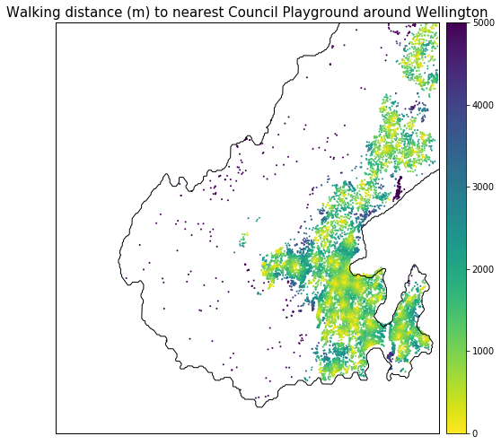
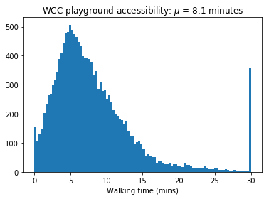
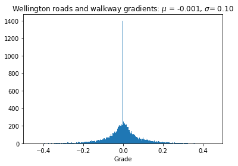

In the [previous posts](https://shriv.github.io/Playgrounds-vs-pubs/), we calculated accessibility in terms of distance. Distance is an excellent metric for driving or walking on flat land. For short travels by car or walking on flat land, distance can be directly converted to travel time. Most people have an intuitive understanding of their average driving speeds (50 km/h for residential roads in New Zealand) or their approximate walking speed on flat land (usually around 5 km / h for a fit adult as given in [Section 3.4 in NZTA pedestrian planning and design guide](https://www.nzta.govt.nz/assets/resources/pedestrian-planning-guide/docs/pedestrian-planning-guide.pdf)). Hills are not an issue for drivers provided road quality and safety are no different to flat land. But hills do impact travel time for pedestrians; which in turn impacts accessibility.

> _How prohibitive is Wellington’s topology on pedestrian accessibility to playgrounds?_

Playgrounds are key amenities that can impact the quality of life for young families. Since they are also frequently accessed on foot, it's important to consider how accessible they really are. Particularly for suburbs with a high residential fraction.   

## Technical details
We need to overcome some technical issues to do this analysis:
- Re-do accessibility metric: from distance to travel time
- Get elevation data for roads and walkways
- Convert elevation to road / walkway inclination
- Incorporate inclination in the accessibility analysis
    - Include road inclines in the pandana network
    - Estimate the impact of inclination on travel time

## Datasets

Two key datasets are used in this analysis:
- *WCC playground locations*: downloaded as a zip file
- *Wellington street network*
    - without elevation: using OpenStreetMap via *pandana*
    - with elevation: using OpenStreetMap and Google Elevation API via *osmnx*


### WCC Playgrounds
The WCC playground data is easy to consume as it's just a set of geolocations. The form is appropriate for accessibility analysis too since 'Points of Interest' (POIs) are always single, representative coordinates (rather than polygons).

<div class="iframe_container">
<iframe src="../images/2019-02-19-Impact-of-hills-on-walking-to-playgrounds-in-Wellington/map_playgrounds.html"
style="width: 100%; height: 450px;"></iframe>
</div>

### Wellington street network: without elevation
Getting the Wellington street network in a form suitable for accessibility analysis is trivial. The previous posts [on fuel station](https://shriv.github.io/Fuel-Stations-Analysis-Part-3/) and [playground](https://shriv.github.io/Playgrounds-vs-pubs/) acessibility cover the process in detail. Without delving into the specifics, the process basically involves calling _pandana's_ OpenStreetMap loader. And voila, we have a street network that can be consumed by _pandana_ for the accessibility analysis.

The _pandana_ network above has edge weights in the default units of metres, which means that the accessibility analyses will also be in metres. We can post-hoc convert the distance units to travel time with an average walking speed of 5 km/h or, 83 m/minute if we want travel time in minutes.

|Accessibility as distance | Accessibility as travel time |
|---|---|
|||

The accessibility data can be extracted and plotted as a histogram. Here, we see that the average distance to a playground is 700 m, or an 8 minute walk.

| Distance distribution | Time distribution |
|---|---|
|| |

### Wellington street network: with elevation
Elevation information can be retrieved with the Google Elevation API to enrich both the nodes and edges of the network. For the nodes, we can just get the elevation at a single location. Elevation at the connecting nodes of an edge can be used to derive the _inclination_.

The above steps have been simplified to terse oneliners by the excellent Python package, _osmnx_. The steps to generate a _pandana_ network for accessibility analyses enriched with road inclinations are given below. They're mostly borrowed from [Geoff Boeing's tutorial](https://geoffboeing.com/2017/05/osmnx-street-network-elevation/).
- [Signing up to the Google Elevation API](https://developers.google.com/maps/documentation/elevation/start) and getting an API key.
- Storing the API key in an YAML file (to stop commits that contain keys! - something I've been guilty of many times over)
- Creating an _osmnx_ graph
- Retrieving elevation data from Google Elevation API
- Adding elevation information to nodes
- Adding inclination (grade) to edges
- Converting edge weights to travel time
- Creating a _pandana_ network from an _osmnx_ graph


```python
# Open the API keys stored in a YAML file
with open("utils/api_keys.yaml", 'r') as stream:
    data_loaded = yaml.load(stream)

# Get Google Elevation API key
google_elevation_api_key = data_loaded['google_elevation_api_key'][0]

# Create an OSMNX walking street netwoek for the Wellington bounding box
G = ox.graph_from_bbox(north, south, east, west, network_type='walk')

# Add elevation values for the nodes in the OSMNX graph
G = ox.add_node_elevations(G, api_key=google_elevation_api_key)

# Generate an edge grade (inclination) with the elevations at the nodes
G = ox.add_edge_grades(G)
```

#### Wellington street elevation profile
Osmnx can download the Google street elevations and generate an edge weight based on the node elevation values. The graph with street elevations can be shows that Wellington is largely flat around the coastline but is surrounded by hills. Larger suburbs like Karori and Johnsonville have been built on elevated plateaus.

| All street inclines | "Flat" regions (within 5% gradient) |
| --- | ---|
||  |


### Dealing with MultiDiGraph
Osmnx generates an elevation graph as a multidigraph. That is, the edge (u,v) is also present as (v,u) with the _opposite_ gradient. This is why the average elevation profile is 0!
For a travel time analysis, we need to split the components of the graph.



#### Undirected graph

|geometry|grade|grade_abs|length|maxspeed|name|u|v|
|--- |--- |--- |--- |--- |--- |--- |--- |
|LINESTRING (174.7934694 -41.2275193, 174.79300...|0.1319|0.1319|66.800|50|Truscott Avenue|1259077823|1259072929|
|LINESTRING (174.7921165 -41.2280406, 174.79263...|-0.0475|0.0475|65.443|50|Truscott Avenue|1259077823|1259072943|

#### Inverse graph

|geometry|grade|grade_abs|length|maxspeed|name|u|v|
|--- |--- |--- |--- |--- |--- |--- |--- |
|LINESTRING (174.7934694 -41.2275193, 174.79300...|-0.1319|0.1319|66.800|50|Truscott Avenue|1259072929|1259077823|
|LINESTRING (174.7921165 -41.2280406, 174.79263...|0.0475|0.0475|65.443|50|Truscott Avenue|1259072943|1259077823|


### Converting incline distance to travel time

A [simple search](https://books.google.co.nz/books?id=SyulBQAAQBAJ&pg=PA160&lpg=PA160&dq=walking+speed+gradient+accessibility&source=bl&ots=iKmtg73TIV&sig=ACfU3U3N5CAAtqoA0QzfSpJubylfjneWtA&hl=en&sa=X&ved=2ahUKEwiqqeKj3YTgAhVQXn0KHdSFDWsQ6AEwAHoECAkQAQ#v=onepage&q=walking%20speed%20gradient%20accessibility&f=false) led me to [Naismith's Rule](https://en.wikipedia.org/wiki/Naismith%27s_rule) and then to [Tobler's Hiking Function](https://en.wikipedia.org/wiki/Tobler%27s_hiking_function) to calculate travel time as a function of distance and gradient.

I've chosen to go with Tobler's without too much rationale other than its simple form. Tobler's hiking function for speed, $\nu$, is a shifted exponential with three parameters: $a$, $b$ and $c$ which give the fastest speed, speed retardation due to gradient and shift from zero respectively.

$$
\nu = a\exp^{\left(-b.|slope~+~c|\right)}
$$

Note that $slope$ here is the dimensionless quantity: $\frac{dh}{dx}$ (or, rise / run). Tobler's function can also be written with slope in degrees ($^{\circ}$). Speed in km/h can be converted to a travel time in minutes with the factor (60/1000).

While I haven't read Tobler's original paper, a [brief exposition of other equivalent functional forms to Tobler's](https://rpubs.com/chrisbrunsdon/hiking) has been written up by Chris Brunsdon. For a more rigorous analysis, we'll need to refit the form above (or similar) as Brunsdon does for different types of pedestrians. According to NZTA and various other studies, there is significant heterogeneity in walking speed; noth from the route (terrain, incline etc) and also the characteristics of the walker e.g. carrying things, footwear, and demographics. We can likely imagine that a commuter will walk at a very different speed to a father taking his children to the playground during the daytime. Brunsdon's analysis itself shows a very different relationship to Tobler's.

Function | a | b | c
--- | --- | --- | ---
_Meaning_ | Fastest speed | Speed change due to gradient | Gradient of fastest speed |
_Mathematical representation_ | $\nu_{max}$ (km/h) | ($\frac{\Delta\nu}{\Delta ~gradient}$) | $gradient | \nu_{max}$
Tobler | 6 | 3.5 | 0.05
Brunsdon | 3.557 | 2.03 | 0.133


## Accessibility analysis for hilly Wellington

| Flat land assumption | Accounting for Hills |
|--- |--- |
|||


| Difference | Difference > 2.5 minutes |
|--- |---|
| | |


| Nearest playground | Second nearest playground|
|--- |---|
|||


## Validating the accessibility analysis

### With Google Maps
[110 John Sim's Drive](https://www.openstreetmap.org/node/6083853567) to Kipling St Play Area in Johnsonville.
- [Uphill from the park](https://www.google.co.nz/maps/dir/Kipling+Street+Play+Area,+Johnsonville,+Wellington/110+John+Sims+Dr,+Johnsonville,+Wellington+6037/@-41.2287819,174.7921861,15.94z/data=!4m14!4m13!1m5!1m1!1s0x6d38adc0eacfab81:0xb46b5857955895d8!2m2!1d174.797878!2d-41.2251416!1m5!1m1!1s0x6d38ade99a925aa1:0x68fba1d12c2d8b01!2m2!1d174.7921832!2d-41.229301!3e2): 14 minutes
- [Downhill to the park](https://www.google.co.nz/maps/dir/110+John+Sims+Dr,+Johnsonville,+Wellington+6037/Kipling+Street+Play+Area,+Johnsonville,+Wellington/@-41.2287819,174.7921861,15.94z/data=!3m1!4b1!4m14!4m13!1m5!1m1!1s0x6d38ade99a925aa1:0x68fba1d12c2d8b01!2m2!1d174.7921832!2d-41.229301!1m5!1m1!1s0x6d38adc0eacfab81:0xb46b5857955895d8!2m2!1d174.797878!2d-41.2251416!3e2): 11 minutes

The current analysis functions (using Google Elevation, OSM street network and Tobler's time conversion) gives the following result.

> 110 John Sims Drive to Kipling Street Play Area: Street distance is  925 m. At 5km/hr, it takes 11.1 mins. Going to the park (downhill) takes 11.9 mins. Coming back from the park (uphill) takes 12.3 mins'

We don't expect the OSM street data to differ much from Google (at least for a city!) and the elevation data should be identical. The key difference is likely the distance to time conversion. Tobler's time conversion is definitely an ambitious target - especially for families walking with young children. For a more accurate analysis, we'd need recommendations of a more sensible top speed and hill climbing speed retardation from Urban Planners.


### With Graphhopper Routing API

Visualised [here](https://www.openstreetmap.org/directions?engine=graphhopper_foot&route=-41.28228%2C174.76145%3B-41.28352%2C174.76559#map=17/-41.28247/174.76603)


```python
graph_hopper_api_key = data_loaded['graph_hopper_api_key'][0]
graph_hopper_query = "https://graphhopper.com/api/1/route?point=-41.28228,174.76145&point=-41.28352,174.76559&vehicle=foot&points_encoded=false&locale=nz&key=" + graph_hopper_api_key
```


```bash
%%bash -s "$graph_hopper_query"
curl $1
```

    {"hints":{"visited_nodes.average":"44.0","visited_nodes.sum":"44"},"info":{"copyrights":["GraphHopper","OpenStreetMap contributors"],"took":11},"paths":[{"distance":714.815,"weight":423.840217,"time":514662,"transfers":0,"points_encoded":false,"bbox":[174.761453,-41.283523,174.765629,-41.282102],"points":{"type":"LineString","coordinates":[[174.761453,-41.282274],[174.761556,-41.28231],[174.761589,-41.282407],[174.761905,-41.282449],[174.761958,-41.282571],[174.761933,-41.282646],[174.761754,-41.282885],[174.761788,-41.283035],[174.761917,-41.28316],[174.76219,-41.283275],[174.762386,-41.283379],[174.762797,-41.28334],[174.76299,-41.283305],[174.763289,-41.283009],[174.763493,-41.282658],[174.763737,-41.282442],[174.764054,-41.282246],[174.764241,-41.282201],[174.764536,-41.282165],[174.764845,-41.282102],[174.764858,-41.282178],[174.764869,-41.282245],[174.765038,-41.282236],[174.765055,-41.282515],[174.765029,-41.282649],[174.764967,-41.282802],[174.765087,-41.282817],[174.765072,-41.282912],[174.765298,-41.282989],[174.765114,-41.283073],[174.765338,-41.283153],[174.765307,-41.28321],[174.765302,-41.283272],[174.765344,-41.283328],[174.765628,-41.283451],[174.765629,-41.283497],[174.765594,-41.283523]]},"instructions":[{"distance":204.951,"heading":109.37,"sign":0,"interval":[0,10],"text":"Continue onto Military Road","time":147563,"street_name":"Military Road"},{"distance":51.359,"sign":-1,"interval":[10,12],"text":"Turn slight left onto West Way","time":36978,"street_name":"West Way"},{"distance":218.789,"sign":-7,"interval":[12,19],"text":"Keep left onto West Way","time":157528,"street_name":"West Way"},{"distance":8.555,"sign":2,"interval":[19,20],"text":"Turn right onto Mamaku Way","time":6159,"street_name":"Mamaku Way"},{"distance":7.454,"sign":0,"interval":[20,21],"text":"Continue onto Mamaku Way","time":5366,"street_name":"Mamaku Way"},{"distance":18.685,"sign":-2,"interval":[21,22],"text":"Turn left","time":13453,"street_name":""},{"distance":65.017,"sign":2,"interval":[22,25],"text":"Turn right","time":46812,"street_name":""},{"distance":81.409,"sign":-2,"interval":[25,30],"text":"Turn left","time":58614,"street_name":""},{"distance":54.442,"sign":2,"interval":[30,35],"text":"Turn right","time":39198,"street_name":""},{"distance":4.155,"sign":1,"interval":[35,36],"text":"Turn slight right","time":2991,"street_name":""},{"distance":0.0,"sign":4,"last_heading":224.49059371020783,"interval":[36,36],"text":"Arrive at destination","time":0,"street_name":""}],"legs":[],"details":{},"ascend":18.532989501953125,"descend":90.9019889831543,"snapped_waypoints":{"type":"LineString","coordinates":[[174.761453,-41.282274],[174.765594,-41.283523]]}}]}

      % Total    % Received % Xferd  Average Speed   Time    Time     Time  Current
                                     Dload  Upload   Total   Spent    Left  Speed
    100  2697  100  2697    0     0   1835      0  0:00:01  0:00:01 --:--:--  1837

# Some extra fun stuff
## Park access isochrones


[110 John Sims Drive centred map with radius ~1000m](https://www.google.co.nz/maps/place/110+John+Sims+Dr,+Johnsonville,+Wellington+6037/@-41.2293256,174.7884295,1008m/data=!3m1!1e3!4m5!3m4!1s0x6d38ade99a925aa1:0x68fba1d12c2d8b01!8m2!3d-41.229301!4d174.7921832)


