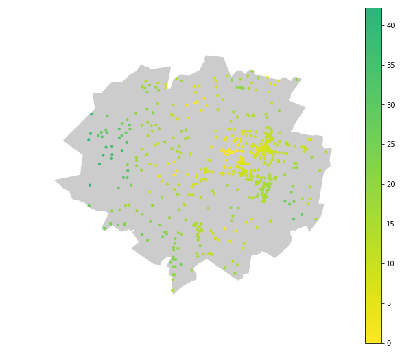
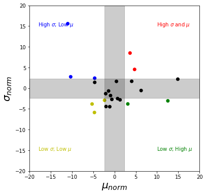

*__WORK IN PROGRESS__*

# Introduction
Before diving into the nitty gritty of modelling accessibility across the different suburbs, it's worth taking a high-level persepective into _why_ modelling is useful. I hope to make the case that approximating reality with models, allows us to dredge some deep insights - from the accessibility characteristics of a suburb to reasons why some suburbs don't fit our approximations.


## The goal of statistical modelling
The best reason for trying our hand at statistical modelling comes from entertaining and brilliant pedagogue: Ben Lambert. His _particular_ views are in favour of the Bayesian approach to statistical inference. While this analysis doesn't necessarily gain _more_ insight / easy explanations from a Bayesian approach, I've chosen to use it anayway because I've now completely avowed to _The Bayesian Way_ (_Bayes-Do_?). 

> In life, noise obfuscates signal. What we seen often appears as an incoherent mess that lacks any appearance of logic.

> Statistical inference is the logical framework we can use to trial our beliefs about the noisy world against _data_. We formalise our beliefs in models of _probability_.

<p style='font-size: 90%; text-align: right; font-style:italic;'>
  - A Student's Guide to Bayesian Statistics, Ben Lambert (p 17)
</p>
<br>

## Models as an approximation of reality
Models are a key tool of data science.

## A case against modelling?

| Data science cycle | Data analysis cycle |
| :----------------: | :-----------------: |
|   |   |
| Actions from model output / insights  | Actions directly from exploratory analysis |

<p style='font-size: 90%; text-align: right; font-style:italic;'>
  - Images &copy; [Kat Greenbrook](https://www.linkedin.com/pulse/data-stories-glue-analytics-cycle-kat-greenbrook/)
</p>
<br>


## Technical details
To do this analysis, we need to overcome some technical aspects:

- Test a Bayesian model at the suburban level
- Compare suburban averages in Wellington
- Compare suburban heterogeneity in Wellington
- Use average and heterogeneity, relative to Wellington average, to classify accessibility characteristic for a given suburb.

# Datasets

| Dataset | Format | Link |
| :-----: | :----: | :--: |
| WCC playground locations  | .zip| [Wellington City Council](https://data-wcc.opendata.arcgis.com/datasets/c3b0ae6ee9d44a7786b0990e6ea39e5d_0)|
| WCC suburb boundaries  | .gdb | [Wellington City Council](https://data-wcc.opendata.arcgis.com/datasets/f534738cf3e648f7b1524a9697376764_0) |
| StatsNZ 2019 meshblock boundaries | .gdb | [Stats NZ](https://datafinder.stats.govt.nz/layer/98971-meshblock-higher-geographies-2019-generalised/data/) |
| Wellington street network without elevation | - | OpenStreetMap via osmnx |
| Wellington street network with elevation | - | OpenStreetMap + Google Elevation API via osmnx|


# Accessibility by Wellington suburb


## Visualising accessibility within suburb boundaries





# Bayesian Modelling of accessibility
This section is all about writing Bayesian models with Stan.


```python
uni_norm_model = su.load_or_generate_stan_model('stan', 'univariate_normal')
lower_trunc_norm_model = su.load_or_generate_stan_model('stan', 'lower_truncated_univariate_normal')
trunc_norm_model = su.load_or_generate_stan_model('stan', 'truncated_univariate_normal')
```


## Normal Model

```
Inference for Stan model: anon_model_cc3fc1beb21cbbe7b94ad66105c98210.
4 chains, each with iter=2000; warmup=1000; thin=1;
post-warmup draws per chain=1000, total post-warmup draws=4000.

         mean se_mean     sd   2.5%    25%    50%    75%  97.5%  n_eff   Rhat
mu      22.99  6.3e-3   0.35   22.3  22.75  22.99  23.23  23.67   3113    1.0
sigma   14.28  4.3e-3   0.26  13.79   14.1  14.27  14.45  14.79   3630    1.0
y_pred  22.71    0.23   14.3  -5.62  12.89  22.82  32.59  50.67   4000    1.0
lp__    -5086    0.02    1.0  -5089  -5087  -5086  -5085  -5085   1809    1.0

Samples were drawn using NUTS at Mon Mar 18 15:07:35 2019.
For each parameter, n_eff is a crude measure of effective sample size,
and Rhat is the potential scale reduction factor on split chains (at
convergence, Rhat=1).
```

## Truncated Normal model for better fit

| Normal Model | Truncated Normal Model |
| :----------: | :--------------------: |
| | |


## Checking model performance with posterior predictive

### Good fit


### Poor fit


 - Doesn't capture modes - likely due to the fact that Rongotai has both a residential and an industrial area.

### Other issues


## Hierarchical modelling

## Results for $\mu$


## Results for $\sigma$


## Quadrant visualisation of $\sigma$ and $\mu$
We can visualise both the $\mu$ and $\sigma$ values on a single graph to identify suburbs that are outside the average along both parameters. The best way to look at suburbs outside the average is with a classic "quadrant" plot.

Quadrant plots show points along an intuitive



### High $\sigma$
| suburb | quadrant | $\sigma$ | $\mu$ |
|--- |--- |--- |--- |
|Khandallah|High $\sigma$ and $\mu$|4.641167|8.685588|
|Karori|High $\sigma$ and $\mu$|8.664240|7.424094|
|Tawa|High $\sigma$; Low $\mu$|2.839867|-6.406689|
|Brooklyn|High $\sigma$; Low $\mu$|15.768424|-7.285322|


### Low $\sigma$
| suburb | quadrant | $\sigma$ | $\mu$ |
|--- |--- |--- |--- |
|Pipitea|Low $\sigma$; High $\mu$|-2.964546|16.522374|
|Hataitai|Low $\sigma$; High $\mu$|-3.707169|7.069155|
|Wellington Central|Low $\sigma$; High $\mu$|-2.408587|4.671688|
|Kelburn|Low $\sigma$; High $\mu$|-2.693675|5.273022|
|Miramar|Low $\sigma$; High $\mu$|-2.618647|3.321520|
|Mount Cook|Low $\sigma$; High $\mu$|-4.369413|2.831357|
