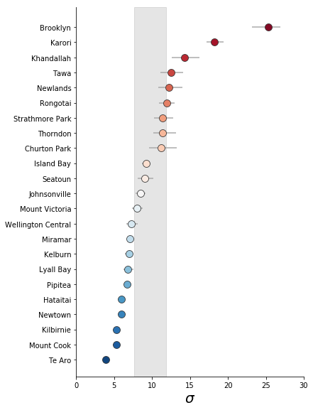

*__WORK IN PROGRESS__*

# Introduction
Before diving into the nitty gritty of modelling accessibility across the different suburbs, it's worth taking a high-level persepective into _why_ modelling is useful. I hope to make the case that approximating reality with models, allows us to dredge up some deep and useful insights: (1) the accessibility characteristics of a suburb and, (2) reasons why some certain suburban characteristics don't fit our approximations.


## The goal of statistical modelling
The best reason for trying our hand at statistical modelling comes from the entertaining and brilliant pedagogue: [Ben Lambert](https://ben-lambert.com/about/).

> In life, noise obfuscates signal. What we see often appears as an incoherent mess that lacks any appearance of logic.

> Statistical inference is the logical framework we can use to trial our beliefs about the noisy world against _data_. We formalise our beliefs in models of _probability_.

<p style='font-size: 90%; text-align: right; font-style:italic;'>
  - A Student's Guide to Bayesian Statistics, Ben Lambert (p 17)
</p>
<br>

In his book, Lambert goes on to elaborate the gains acheived from employing a Bayesian approach to statistical inference. Our analysis into accessibility by suburb does benefit from a Bayesian approach but I've chosen to use it anayway since I'm now completely avowed to _The Bayesian Way_ (_Bayes-Do_?).


## Models as an approximation of reality
The core component of statistical inference is a _statistical model_ - often shortened to just _model_. Common models formalise the data generation process  by quantifying the relationhip between inputs and outcomes. For example, linear regression models quanitfy the relationship between a set of user-defined inputs and the possible outcomes given those inputs.

The model we're using in this post are much simpler: we're considering the probability space of the outcomes - with a particular interest in the summary statistics: mean, $\mu$, and standard deviation, $\sigma$. As we'll see later on, we choose a particular mathematical form to represent the probability space of accessibilities within a suburb. The specific parameters of the model, $\mu$ and $\sigma$, are calculated using the observed accessibility data.

## Model with care
It's worth noting that not all data-driven questions benefit from statistical modelling. Models can be complicated and difficult to explain to others - even technically-oriented peers. In view of this, some data evangelists advocate a simpler analysis process. Kat Greenbrook highlights how the [modelling aspect can be left out for many business analytics questions](https://www.linkedin.com/pulse/data-stories-glue-analytics-cycle-kat-greenbrook/).

| Data Science cycle | Data Analysis cycle |
| :----------------: | :-----------------: |
|   |   |
| Actions from model output / insights  | Actions directly from exploratory analysis |

<p style='font-size: 90%; text-align: right; font-style:italic;'>
  - Images &copy; <a href="https://www.linkedin.com/pulse/data-stories-glue-analytics-cycle-kat-greenbrook/">Kat Greenbrook</a>
</p>
<br>

Data anlysis alone can be very powerful. Exploratory analyses can unearth many useful insights that can be followed through with business actions. As people who harness data for a purpose, we must constantly evaluate whether the added complexity of the model layer is adding utility and significant insight.

> Modelling should never be undertaken if there is not a clear use case for the output.

<p style='font-size: 90%; text-align: right; font-style:italic;'>
  - <a href="https://www.linkedin.com/pulse/data-stories-glue-analytics-cycle-kat-greenbrook/">Kat Greenbrook</a>
</p>
<br>


## Model for a reason
Now that we have been cautioned to think before we model, we can identify how models would be useful to understand playground accessibility in Wellington.

In the [previous post](https://shriv.github.io/Impact-of-hills-on-walking-to-playgrounds-in-Wellington/), we ended with a heatmaps of accessibility in terms of total travel times. These plots conveyed a holistic picture of areas with worse accessibility due to the hilly topography. However, we can't pick out many relevant details from an overview. For example, we might care about how our specific neighbourhood compares to another, or even our neighbourhood vs. the average for the city.

Comparisons can be done with single point values alone. But, robust comparisons rely on statistical inference - the most classic being the [_t-test for comparing two means_](https://en.wikipedia.org/wiki/Student%27s_t-test). In the following section, we will see how we can robustly compare suburbs using a statistical model.

Adding a model for comparing suburbs has further utility:
- We can characterise suburbs by the difference to the average for the city.
- We can delve deeper into why some suburbs don't follow the approximation set by the model. Poor fits to the model can illuminate how we might need to adjust the model or, perhaps even exclude some data since it doesn't fit into the scope of the initial question.


# Technical details
To do this analysis, we need to overcome some technical aspects:

| Technical challenge | Covered in |
| :-----------------: | :--------: |
| [Subset accessibility by suburb](#visualising-accessibility-within-suburb-boundaries)| Blog Post |
| [Build a Bayesian model for an individual suburb](#bayesian-modelling-of-accessibility) | |
| [Model average ($\mu$) and heterogeneity ($\sigma$) on two levels: (1) each suburb and, (2) across all suburbs](#hierarchical-modelling) | Blog Post |
| [Use average and heterogeneity, relative to Wellington average, to classify accessibility characteristic for a given suburb](#quadrant-visualisation) | Blog Post |


## Datasets

| Dataset | Format | Link |
| :-----: | :----: | :--: |
| WCC playground locations  | .zip| [Wellington City Council](https://data-wcc.opendata.arcgis.com/datasets/c3b0ae6ee9d44a7786b0990e6ea39e5d_0)|
| WCC suburb boundaries  | .gdb | [Wellington City Council](https://data-wcc.opendata.arcgis.com/datasets/f534738cf3e648f7b1524a9697376764_0) |
| StatsNZ 2019 meshblock boundaries | .gdb | [Stats NZ](https://datafinder.stats.govt.nz/layer/98971-meshblock-higher-geographies-2019-generalised/data/) |
| Wellington street network without elevation | - | OpenStreetMap via osmnx |
| Wellington street network with elevation | - | OpenStreetMap + Google Elevation API via osmnx|


# Accessibility by Wellington suburb


## Visualising accessibility within suburb boundaries


## Extracting accessibility distributions by suburb


# Bayesian Modelling of accessibility
This section is all about writing Bayesian models with Stan.


```python
uni_norm_model = su.load_or_generate_stan_model('stan', 'univariate_normal')
lower_trunc_norm_model = su.load_or_generate_stan_model('stan', 'lower_truncated_univariate_normal')
trunc_norm_model = su.load_or_generate_stan_model('stan', 'truncated_univariate_normal')
```


## Normal Model

```
Inference for Stan model: anon_model_cc3fc1beb21cbbe7b94ad66105c98210.
4 chains, each with iter=2000; warmup=1000; thin=1;
post-warmup draws per chain=1000, total post-warmup draws=4000.

         mean se_mean     sd   2.5%    25%    50%    75%  97.5%  n_eff   Rhat
mu      22.99  6.3e-3   0.35   22.3  22.75  22.99  23.23  23.67   3113    1.0
sigma   14.28  4.3e-3   0.26  13.79   14.1  14.27  14.45  14.79   3630    1.0
y_pred  22.71    0.23   14.3  -5.62  12.89  22.82  32.59  50.67   4000    1.0
lp__    -5086    0.02    1.0  -5089  -5087  -5086  -5085  -5085   1809    1.0

Samples were drawn using NUTS at Mon Mar 18 15:07:35 2019.
For each parameter, n_eff is a crude measure of effective sample size,
and Rhat is the potential scale reduction factor on split chains (at
convergence, Rhat=1).
```

## Truncated Normal model for better fit

| Normal model | Truncated Normal model |
| :----------: | :--------------------: |
| | |


## Checking model performance with posterior predictive

### Good fit


### Poor fit


 - Doesn't capture modes - likely due to the fact that Rongotai has both a residential and an industrial area.

### Other issues


## Hierarchical modelling

## Results for $\mu$


## Results for $\sigma$


## Quadrant visualisation
We can visualise both the $\mu$ and $\sigma$ values on a single graph to identify suburbs that are outside the average along both parameters. The best way to look at suburbs outside the average is with a classic "quadrant" plot.

Quadrant plots show points along an intuitive


### High $\sigma$

| suburb | quadrant | $\sigma$ | $\mu$ |
|--- |--- |--- |--- |
|Khandallah|High $\sigma$ and $\mu$|4.641167|8.685588|
|Karori|High $\sigma$ and $\mu$|8.664240|7.424094|
|Tawa|High $\sigma$; Low $\mu$|2.839867|-6.406689|
|Brooklyn|High $\sigma$; Low $\mu$|15.768424|-7.285322|


### Low $\sigma$

| suburb | quadrant | $\sigma$ | $\mu$ |
|--- |--- |--- |--- |
|Pipitea|Low $\sigma$; High $\mu$|-2.964546|16.522374|
|Hataitai|Low $\sigma$; High $\mu$|-3.707169|7.069155|
|Wellington Central|Low $\sigma$; High $\mu$|-2.408587|4.671688|
|Kelburn|Low $\sigma$; High $\mu$|-2.693675|5.273022|
|Miramar|Low $\sigma$; High $\mu$|-2.618647|3.321520|
|Mount Cook|Low $\sigma$; High $\mu$|-4.369413|2.831357|
