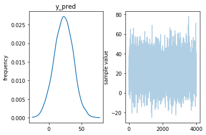

# Introduction
*__WORK IN PROGRESS__*

## Technical details
To do this analysis, we need to overcome some technical aspects:
- Test a Bayesian model at the suburban level
- Model accessibility at the meshblock level
- Gather modeled meshblock accessibilities at the suburban level
- Compare suburban averages in Wellington

# Datasets

| Dataset | Description | Format | Link |
| :-----: | :---------: | :----: | :--: |
| WCC playground locations | jsdh | .zip| [Wellington City Council](https://data-wcc.opendata.arcgis.com/datasets/c3b0ae6ee9d44a7786b0990e6ea39e5d_0)|
| WCC suburb boundaries | ;lf | .gdb | [Wellington City Council](https://data-wcc.opendata.arcgis.com/datasets/f534738cf3e648f7b1524a9697376764_0) |
| StatsNZ 2019 meshblock boundaries | ;lf | .gdb | [Stats NZ](https://datafinder.stats.govt.nz/layer/98971-meshblock-higher-geographies-2019-generalised/data/) |
| Wellington street network without elevation | ksfj| kjfd | Open Street Map |
| Wellington street network with elevation | ksfj| kjfd | lkd|


# Accessibility by Wellington suburb


## Visualising accessibility within suburb boundaries


# Bayesian Modelling of accessibility
This section is all about writing Bayesian models with Stan.


```python
uni_norm_model = su.load_or_generate_stan_model('stan', 'univariate_normal')
lower_trunc_norm_model = su.load_or_generate_stan_model('stan', 'lower_truncated_univariate_normal')
trunc_norm_model = su.load_or_generate_stan_model('stan', 'truncated_univariate_normal')

```


## Normal Model

    Inference for Stan model: anon_model_cc3fc1beb21cbbe7b94ad66105c98210.
    4 chains, each with iter=2000; warmup=1000; thin=1;
    post-warmup draws per chain=1000, total post-warmup draws=4000.

             mean se_mean     sd   2.5%    25%    50%    75%  97.5%  n_eff   Rhat
    mu      22.61  5.6e-3   0.32  21.96   22.4  22.61  22.82  23.25   3285    1.0
    sigma   12.62  3.9e-3   0.22  12.21  12.47  12.61  12.76  13.08   3176    1.0
    y_pred  22.58    0.21  12.67  -2.36  14.14  22.53  30.96   47.4   3803    1.0
    lp__    -4887    0.03   1.03  -4890  -4888  -4887  -4887  -4886   1678    1.0

    Samples were drawn using NUTS at Thu Mar  7 13:12:42 2019.
    For each parameter, n_eff is a crude measure of effective sample size,
    and Rhat is the potential scale reduction factor on split chains (at
    convergence, Rhat=1).


### Checking model performance with posterior predictive





## Truncated Normal Model


### Checking model performance with posterior predictive

- Good fit


 - Reasonable fit
 - Doesn't capture modes - likely due to the fact that Karori is a very large suburb


- Poor fit
- Model is overwhelmed by the large spike at 60 minutes
- Makara is basically semi-rural and shouldn't be modelled the same as urban suburbs


## Hierarchical modelling


