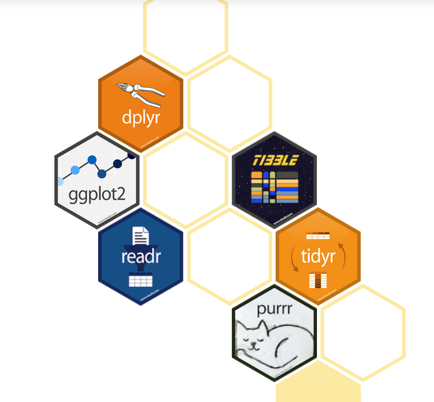
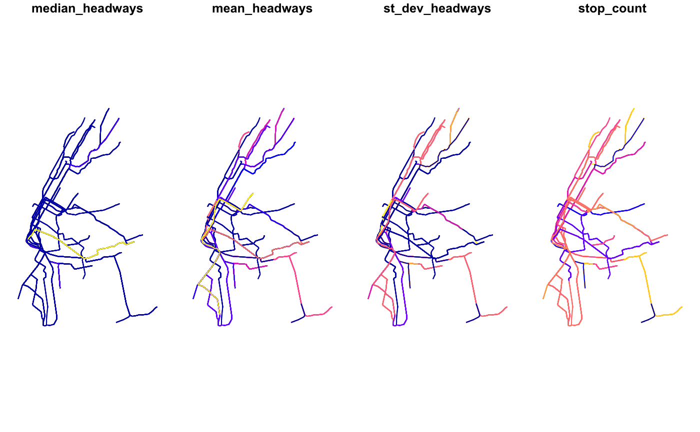

# Summary
_IN PROGRESS_

# Introduction
The battle of R vs. Python for data science is a constantly raging one for practitioners. Many choose their side and stick to it vehemently but others, like me, flit from one side to another using the 'Whatever is best for problem at hand' excuse. I say 'excuse' because sometimes it feels like I'm simply biding my time for a clear winner to emerge. At other times, 'excuse' is the wrong word because I do truly feel like each has their strengths and cutting-edge tools and packages are not developed simultaneously in both ecosystems.

My first port of call is usually Python, even though I think **dplyr** (and the **tidyverse**) is far better than **pandas**. Python is an easy start because:

- The syntax is easy
- Verbose loops for lazy and quick coding aren't poorly performant (unlike R!)
- You don't have to remember too many onliners / idioms

 Reason (3) is touted as a major scoring point for R afficianados but when data science work spans across many domains, the suite of necessary packages (and idioms) grows substantially - a real travail for those of us with poor memory.

True to my preference my previous forays into analysing transport, specifically walking, have used the Python suite of geospatial and analysis packages e.g. **geopandas**, **osmnx**, **pandana**, **pandas**, **numpy**, **seaborn** and **pystan**. However, in less than a week, I'll be transitioning to a new employer whose data science will be driven by R. This imminent move has prompted a self-learning spike culminating in this literature review of R packages that support spatial analyses (particularly pertaining to transport).

 I hope to split this review into three main parts; starting with a focus on R tools, exploring the Python side and wrapping up with a comparison of the two ecosystems. The reason for this triple pronged approach links back to the introduction citing the asymmetry in functionality available in R vs. Python. I know there are other 'on the fence' Data Scientists so I'm hopeful that this review will save some time and effort in scouting out the best tool / ecosystem for geospatial analyses.

# Enter Dr. Robin Lovelace
A quick Google search will reveal that the lynchpin of knowledge, innovative work, and  package development in the R geospatial world is [Dr. Robin Lovelace](https://www.robinlovelace.net/). He's an active developer of **stplanr**, a key transport analysis package, and part of several other open data and open transport initiatives. For example, [Propensity to Cycle Tool (PCT)](http://www.pct.bike/), [Active Transport Futures](https://atfutures.github.io/) and a recent open textbook [Geocomputation with R](https://geocompr.robinlovelace.net/).

Singling Robin Lovelace out is not meant to downplay the contributions of countless others but that he plays quite a central role in opening up the R geospatial world to a relative newbie. For example, much of this particular post is inspired by [Robin's talk at UseR2019](https://www.robinlovelace.net/presentations/user2019-r-for-transport-planning.html#1).

The R geospatial movement that Robin is part of looks very familiar to the explosion of concerted activity that accompanied **ggplot2** and **dplyr**. Now, these pioneering packages form a core suite of R packages for Data Science known as the [tidyverse](https://www.tidyverse.org/).

<figure>
 
 <figcaption>Modular packages of the tidyverse. _Image from the tidyverse website_</figcaption>
</figure>

A similar vision appears to be in place for geospatial analyses with core packages like **stplanr**, **dodgr** and **tidytransit** (described in the next section) slotting together nicely.

[FIGURE I've drawn of dodgr, stplanr, tidytransit]

# The limited package tour
Or perhaps _Caveat Lector_ (Reader Beware) - a dramatic way of noting that this review is not intended to be a comprehensive one. Following Robin's presentation, the following core packages are described in some detail: **dodgr**, **tidytransit** and **stplanr**. While this set of packages is not comprehensive, they conver considerable ground in terms of possible geospatial analyses:

- Wrangling geospatial data formats
  - spatial primitives
  - Origin-Destination data
  - street networks
  - GTFS
- Calculations and aggregations on spatial objects
  - Network analysis algorithms applied to street networks
  - Routing along the street network with graph algorithms or API calls
  - Aggregating geospatial street network metadata including spatial flows

## stplanr
A transport planning utility developed by Robin Lovelace. According to the vignette, **stplanr** facilitates common transport planning tasks including:

- downloading and cleaning transport datasets
- creating geographic ‘desire lines from origin-destination (OD) data
- route assignment, via the SpatialLinesNetwork class
- interfacing to routing services such as CycleStreets.net
- calculation of route segment attributes such as bearing and aggregate flow
- `travel watershed’ (catchment area) analysis

### Routing

### Transport planning
**stplanr** is intended as a complementary tool to the more intensive transport modelling packages like **SUMO**. At a basic level, transport modelling starts with the Four Stage Transport Model.

<figure>
 
 <figcaption>Four Stage transportation model. _Original figure reference hard to trace._</figcaption>
</figure>

- Stage 1: Trips are estimated with available data including demographics and availability of jobs.
- Stage 2: Trips are then distributed according to a mathematical decay function - where closer trips are more probable than ones further away.
- Stage 3: Trips are split by mode type - at a trivial level, deciding what fraction will be done by car vs. other modes like public transport, walking etc. (stage 3).
- Stage 4: Origin-Destination flows are assigned to the street network.

<figure>
 
 <figcaption>**stplanr** example: Origin-Destination flows overlaid on street network followed by aggregation of flows onto the street network itself. _Image from the stplanr paper in The R Journal_</figcaption>
</figure>

### Catchment areas
<figure>
 
 <figcaption>**stplanr** example: Catchment areas specified by Euclidean distance (red) vs. traversing the street network (blue). _Image from the stplanr paper in The R Journal_</figcaption>
</figure>

## dodgr
An acronym for _Distances On Directed Fraphs in R_. [**dodgr**](https://cran.r-project.org/web/packages/dodgr/vignettes/dodgr.html) can perform graph analysis with street networks and extends graph data aggregation to spatial flow data.

> The dodgr package has been intentionally developed to be adaptable to any type of network, with a particular focus on flow aggregation through street networks.

<figure>
 
 <figcaption>**dodgr** graph. Grey lines could indicated bicycle flows and black lines can be car flows between points on the street network. _Image from the dodgr CRAN vignette page._</figcaption>
</figure>

According to the package site, **dodgr** has a fourfold unique proposition:

- accurate calculation of distances on street networks without excessive data wrangling.
- specifically designed for many-to-many routing
- routines to aggregate flows throughout a network
- highly realistic and fully-customisable profiles for routing through street networks with various modes of transport, and using either distance- or time-based routing

## tidytransit
Use **tidytransit** to map transit stops and routes, calculate transit frequencies, and validate transit feeds. **tidytransit** reads the General Transit Feed Specification into **tidyverse** and **sf** dataframes. The package can also do some insightful spatial aggregations along routes.

# Other packages worth considering

## moveability
An experimental analysis suite that does some clever number crunching of movability. An R version of pandana without needing POIs for walkability analysis. Pictures below show walkability calculations of Munster, Germany.
