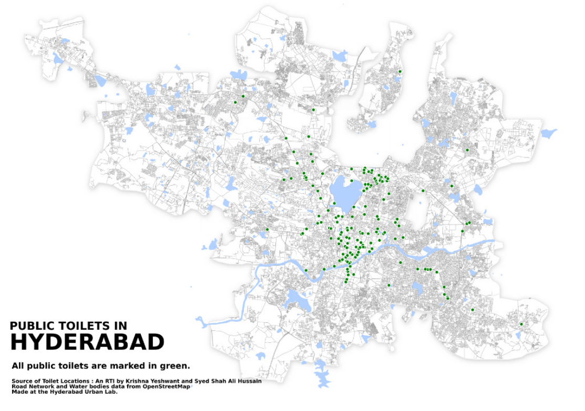
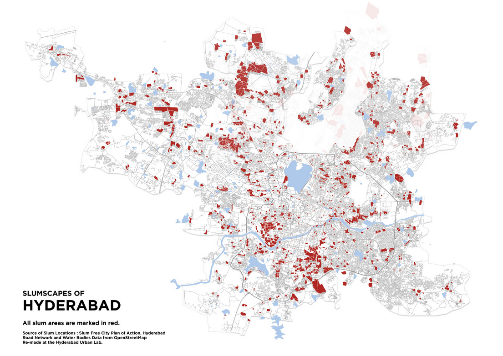

# DRAFT 
# Summary
India's problems with waste are reviewed by academics Assa Doron and Robin Jeffrey in their recent work, Waste of a Nation [1]. They cite poor availability of 'on the ground' data as an important weakness of local urban government in India. In this essay, I highlight two examples of citizen and volunteer-led data projects in two separate Indian meagacities (Chennai and Hyderabad) that have engaged with marginalised commmunities to generate open data about their waste infrastructure issues. 

# Why is India so filthy?

The introduction to Assa Doron and Robin Jeffrey's opus, Waste of a Nation [1], begins with the provocatory question posed by Anamik Nagrik (A.N.): Why is India so filthy? A.N. asserts that it is the poor civic-mindedness of the Indian people. While true to an extent, Doron and Jeffrey delve into the much deeper quagmire of interwoven complexities that belie the vision of filth in India. The authors prise apart layers of human and systemic issues to show that there is much more than the reductive view that Indians are lazy and not civic minded. The enmeshed complexities range from weak local governments, poor political goals for keeping up with the demands of rapid urbanisation, caste politics to incentive structures for  waste management initiatives. 

# Weak local governments with poor geospatial data

A first order analysis of local government functionality, without involving their ability or motivation, is to provide good service to the people. But good service is predicated on knowing what the issues are, what fixes can be possible and how the fixes are working. 'Fix' being a generic term for both reactive work (e.g. a blocked drain) and ongoing work (e.g. water for communities without connected water mains). 

Managing an area to an appropriate level of liveability is a delicate dance between services provided by the municipality and the citizens. A.N's vents highlight the disinterest of the citizens to protect their public spaces by doing their bit to keep them clean and useable by anyone. His suggestions allow for the combined participation of municipality and citizen to make the changes they want to see in their surroundings. 

While citizens must do their part, the service provision requires an active local government that has a good purview of the problems and the available / possible / implemented fixes. Thus, data about the issues at hand are a critical resource for the service provider. However, Doron and Jeffrey highlight poor data as a key weakness of local governments. They go through two examples in their book:

- Not knowing all the residential / commercial premises within its boundaries (page 213-215)
- Waste assets like underground pipes with little to no mapped information (page 258-262)

# A virtuous cycle of NGOs, citizens and government

The lack of useable geospatial data is a disability for functioning public services. As illustrated in the two cases of Chennai and Hyderabd, it can manifest in blatant ignorance of issues or worse, enforcing policies that are simply not realistic for many (particularly the marginalised). 

Luckily for India, this challenge of creating geospatial data and understanding of communities has been taken on by activists and NGOs. As part of this research, I have found two notable entities draw together stories of people and places from around the world: Urban Design Collective (through their bi-annual publication City Observer) and the counter geographies publication, Not an Atlas. The maps in the sections below showcase some incredible work done by individuals and entities represented in these open publications. 

> Public audits and fact-finding missions have long been a useful methodology employed by activist groups and other civil society organisations in India for holding the government accountable for the rights of citizens. We believe that the addition of maps as a tool will be invaluable to this methodology.

- Hyderabad Urban Lab [3]

 

# Data generation through volunteer mapping and surveys

The fishing village, Urur Olcott kuppam, depicted in the figure below, is situated next to an affluent fringe suburb of Chennai. Despite this proximitiy, the fishing village was not  connected to water mains and the villagers had to make do with significantly fewer garbage truck visits.  The unsanitary conditions in the village prompted further worry for the villagers about unlawful land grabbing by property developers wanting to extend the affluent fringes further. 

> It is in this spirit of the community of taking initiative to bring about change that led the secretary of the village panchayat Saravanan to approach the Madras Office for Architects and Designers (MOAD) and Urban Design Collective (UDc) through Coastal Resource Centre in the pursuit of a liveable Urur Olcott Kuppam.

- Urban Design Collective [2]

 

| Urur Olcott kuppam's lack of water and sanitation infrastructure._Image from [2]_ |
|:--:|
| |

After the initial contact from the panchayat leader, volunteers mapped out the kuppam's built environment and conducted household surveys of water use, defecation behaviour and traced the movement of water and of solid waste. This simple but manual effort highlighted the depth of the problems faced by the villagers: 

- Garbage trucks only visited the village twice a week while they visited the affluent area twice a day.
- Without any sanitation infrastructure, the raw sewage was contaminating the very water the villagers derived their living from.

|Digitised map of Urur Olcott kuppam's built environment layered with opportunities for redesigned public spaces. _Image from [2]_ |
|:--:|
| |

# Data to action

The Urur Olcott kuppam project systematically collected data and built development options around data before building proposals that could be presented before sources of funding and the relevant government agencies. 

| Timeline of a volunteer-led project. Project plan to proposal. _Image from [2]_|
|:--:|
| |

# Realistic policies and enforcement

Swacch Bharat Abhiyan (Clean India Mission) is a nation-wide program that aims to clean up India. One of its clear aims is to stop open defecation. An estimated 24% of households in small urban areas (<100k people) and 6% of households in large urban areas (>100k people) engage in open defaction [4]. This practice that is not only rooted in rural habits ported to urban locales through recent migations but also severe limitations in accessible and culturally acceptable options of toilets. 

Doron and Jeffrey illustrate that diverting people's practice from open defecation to public toilets is more than just building a brick shack over a hole in the ground. The latrines have to maintained carefully to convert excrement to benign fertilizer in a way that preserves their dignity and is congruent with their cultural practice. But perhaps, most important of all, they need to be available for use. There is little point in penalising or shaming people for open defecation when there is no other alternative. 

| Mapping public toilets in Hyderabad. _Image from [3]_|
|:--:|
| |

> While the government was targeting the people's attitude towards defecation in public, we published our map in order to put these attitudes in the context of the available infrastructure. Hyderabad, a city of more than 6 million peo-ple, has only 186 public toilets. Our map highlights the unjust and sparse distribution of toilets in the city.

- Hyderabad Urban Lab [3]

 

Even a cursory glance of the public toilets and the slum map shows that there is very poor overlap of public toilets and slums. Maps like these from HUL highlight not only the inaccessibility of necessary infrastructure but also indicate the deep folly of penalties and enforcements for actions that are intrinsically impossible due to the access issues. 

| Mapping slums in Hyderabad. _Image from [3]_|
|:--:|
| |

## Conclusions

## References

1. Doron & Jeffrey, Waste of a Nation (2018) 

2. [Urban Design Collective](http://urbandesigncollective.org/)

3. [Not an Atlas](https://notanatlas.org/)

4. [City Observer, Volume 4 Issue 1](https://issuu.com/urbandesigncollective/docs/city_observer_volume_4_issue_1) (p134-149)

5. [Counter Geographies](https://www.transcript-verlag.de/shopMedia/openaccess/pdf/oa9783839445198.pdf) (p120-124)

6. [A Civic Mapping Project in an Indian Megacity](https://notanatlas.org/maps/a-civic-mapping-project-in-an-indian-megacity/)

